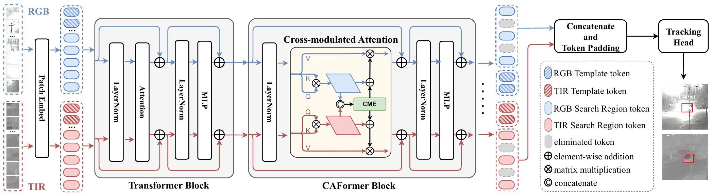

# Introduction

The official implementation of the paper [Cross-modulated Attention Transformer for RGBT Tracking]().

# device
We train and test our model on two Nvidia 2080ti GPU.

# Train

Download SOT pretrained model from [OSTrack](https://github.com/botaoye/OSTrack).
```bash
cd your_proj_path
python utils/make_pretrained.py
sh experiments/caformer/train.sh
```

# Test

```bash
cd your_proj_path
# For RGBT234
sh experiments/caformer/test234.sh
# For LasHeR
sh experiments/caformer/test245.sh
```

# evaluation

You can use the files in `eval_tracker` to quickly evaluate the tracking results.

# download

Tracker | RGBT234 | LasHeR | VTUAV | model | result
---|---|---|---|---|---
CAFormer | 88.3/66.4 | 70.0/55.6| -/- | [download](https://pan.baidu.com/s/1OMl8FgIJF-8DUPu26auQCg?pwd=catp) | [download](https://pan.baidu.com/s/1OMl8FgIJF-8DUPu26auQCg?pwd=catp)
CAFormer | -/- | -/- | 88.6/76.2 | [download](https://pan.baidu.com/s/1OMl8FgIJF-8DUPu26auQCg?pwd=catp) | [download](https://pan.baidu.com/s/1OMl8FgIJF-8DUPu26auQCg?pwd=catp)

# Citation
```
@
```

# Acknowledgments
Thanks for the [OSTrack](https://github.com/botaoye/OSTrack), which helps us to quickly implement our ideas.